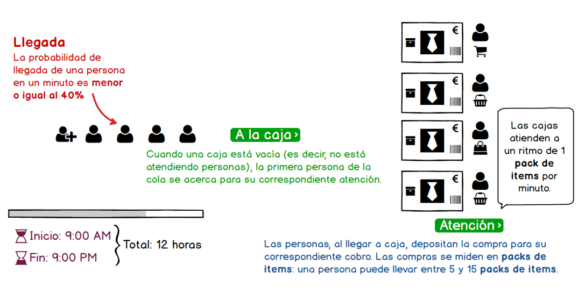

# Reto CCCF

El centro comercial CF de El Alisal trabaja de 9 de la mañana a 9 de la noche vendiendo diversos artículos. 

Para la gestión de la venta dispone de 4 cajas que van atendiendo a los clientes, que a su vez van situándose en fila conforme concluyen sus compras esperando una caja vacía que les atienda.

Un estudio previo determinó que la probabilidad de llegada de un cliente nuevo a la cola se estima en un 40% por minuto.

Cuando una caja está libre (es decir, no está atendiendo a ningún cliente), puede recibir a un nuevo cliente de la cola. Este cliente llevará su compra, la cual el estudio anteriormente citado midió en **packs de items**. El usuario puede llevar un mínimo de 5 y un máximo de 15 pack de items para su atención y se tiene calculado que las cajas tardan 1 minuto en atender un pack de items.

|Escenario
|-|
|
|

Desarrolle un programa que modele y simule el sistema explicado líneas arriba, teniendo en cuenta las condiciones indicadas.

## Reto base

Este programa debe ir mostrando los siguientes datos conforme avance el tiempo:

* Llegada de las personas
* Número de personas en cola
* El estado de atención de las cajas.

## Reto extendido

Extienda el programa anterior para que, al finalizar la jornada, presente un resumen con los siguientes datos:

* Número de minutos en que no hubo nadie en cola.
* Número de personas que estaban en cola al finalizar el día.
* Número de personas atendidas durante el día.
* Número de items vendidos en el día.

## Reto ampliado

Extienda el programa anterior para que soporte los siguientes supuestos:

* En caso que haya más de 15 personas en cola, agregue una persona más en caja, que atienda como mínimo a 5 personas (o mientras hayan más de 15 personas en cola).
* Agregue el rol de superadministrador del sistema, que permita encender o apagar cajas (suponga que puede gestionar hasta 6 cajas).
* 

> Nota: Debido a su complejidad, se sugiere que los retos ampliados se resuelvan uno a la vez y que, dominados los conceptos, se integren en una única solución.